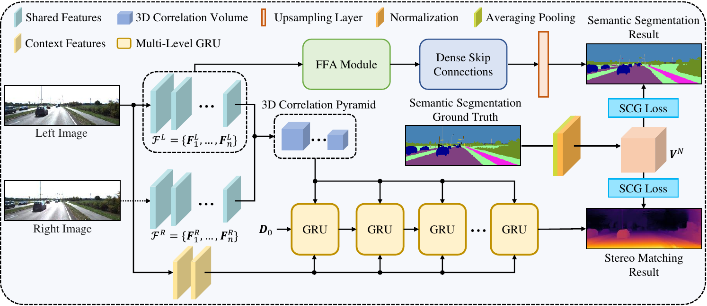

# S3M-Net: Semantic Segmentation and Stereo Matching Joint Learning

This repository provides the core implementation of **S3M-Net**, a joint learning framework for semantic segmentation and stereo matching in autonomous driving scenarios.

## Overview

S3M-Net addresses semantic segmentation and stereo matching simultaneously. Instead of treating the two tasks as independent pipelines, the framework lets both tasks collaboratively exploit RGB image features. Shared stereo representations provide geometric cues, while semantic supervision encourages structural consistency in the predicted scene layout.

<p align="center">
  
</p>

<p align="center">
  <em>The overall pipeline of S3M-Net for joint semantic segmentation and stereo matching.</em>
</p>

The original pipeline figure is also available as [figs/Pipeline.pdf](figs/Pipeline.pdf).

## Contributions

In summary, the main contributions of this article include:

- **S3M-Net**, a joint learning framework designed to address semantic segmentation and stereo matching simultaneously, where both tasks collaboratively leverage the features extracted from RGB images, enhancing the overall understanding of the driving scenario;
- A **feature fusion adaption module** to transform the shared feature maps into semantic space and subsequently fuse them with encoded disparity features;
- A **semantic consistency-guided loss function** to supervise the training process of the joint learning framework, emphasizing on the structural consistency in both tasks.

## Released Contents

This release contains the core model and training/demo entry points:

```text
core/
sampler/
figs/
demo.py
train_stereo.py
```

Datasets, checkpoints, evaluation scripts, and other auxiliary files are not included in this release.

## Installation

Create a Python environment with PyTorch and common computer-vision dependencies:

```bash
conda create -n s3mnet python=3.10 -y
conda activate s3mnet

pip install torch torchvision
pip install numpy opencv-python pillow scipy scikit-image imageio matplotlib tqdm tensorboard opt-einsum
```

The optional CUDA sampler can be built with:

```bash
cd sampler
python setup.py install
cd ..
```

## Demo

Run stereo inference with a prepared checkpoint and stereo image pairs:

```bash
python demo.py \
  --restore_ckpt /path/to/checkpoint.pth \
  --left_imgs "/path/to/left/images/*.png" \
  --right_imgs "/path/to/right/images/*.png" \
  --output_directory demo_output
```

Add `--save_numpy` to save raw disparity arrays in addition to visualizations.

## Training

Train S3M-Net with a prepared stereo and semantic segmentation dataset:

```bash
python train_stereo.py \
  --train_datasets kitti \
  --batch_size 1 \
  --image_size 320 640 \
  --num_steps 1000 \
  --name s3mnet
```

Checkpoints are saved under:

```text
checkpoints/
```

## Repository Status

This repository currently contains the core source files required for S3M-Net model development and basic training/inference. Additional assets such as pretrained weights, datasets, and full evaluation utilities may be released separately.
